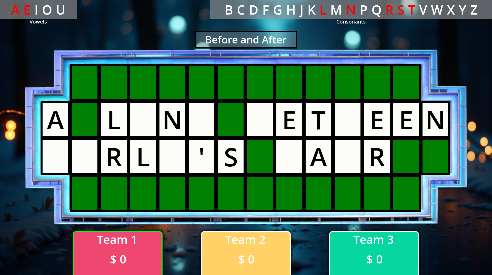

# 🎮 Puzzle-Based Fortune Game

A **two-monitor fortune game** built in **Godot**, designed for interactive and customizable gameplay. One monitor serves as a **control panel** for the host, while the second monitor displays the game for the players. Puzzles are created directly within the game, offering a seamless experience.

## 📦 Overview

The **Puzzle-Based Fortune Game** is an interactive tool perfect for parties, events, or competitions. It assumes the use of an **external fortune wheel** to determine game outcomes and combines it with:
- A **control panel** for hosts to manage the game.
- A **player-facing display** for puzzles and videos.
- The ability to create, edit, and manage puzzles directly within the game.

## 🌟 Key Features
- 🖥️ **Two-Monitor Setup**: 
  - **Monitor 1**: Host control panel for managing puzzles, videos, and game functions.
  - **Monitor 2**: Player-facing display showing puzzles, results, or videos.
- 🧩 **In-Game Puzzle Creation**: No external editors required; create puzzles directly in the game and save them as **JSON**.
- 🎥 **Video Integration**: Load and play videos from the user folder during gameplay.
- 📂 **Organized Storage**: Puzzles and videos are saved in a user-friendly directory (`%appdata%/Godot/user_data` on Windows).

## 🛠️ How It Works

1. **Setup Your Monitors**:
   - Connect two monitors: one for the host and one for players.
   - Configure the game to display the control panel on the host monitor and the game interface on the player monitor.

2. **Control the Game**:
   - Use the control panel to:
     - Create and edit puzzles.
     - Select or trigger specific puzzles or videos.
     - Control the flow of the game for the players.

3. **External Wheel Integration**:
   - Use an external fortune wheel to decide player outcomes.
   - Based on the outcome, select puzzles or videos from the control panel.

4. **Player Display**:
   - Puzzles and results are shown on the player-facing monitor.
   - Videos can be triggered to play for added excitement.

## 📂 Folder Structure

The game uses a dedicated user directory for storing puzzles and videos:
- `puzzles.json`: Automatically saves puzzles created in the game as JSON.
- `videos/`: Add video files here to play them during gameplay.

On Windows, this directory is located at: %appdata%/Godot/user_data

## 🎮 How to Play

1. **Start the Game**:
   Launch the game and set up your monitors:
   - **Host Monitor**: Control panel.
   - **Player Monitor**: Game display.

2. **Create Puzzles**:
   Use the control panel to:
   - Add a question.
   - Provide puzzle rewards.
   - Set the correct answer.

3. **Trigger Gameplay**:
   - Spin the external wheel.
   - Use the control panel to select a puzzle or video based on the wheel’s result.

4. **Showcase to Players**:
   - The selected puzzle or video plays on the player monitor.
   - Manage the game flow seamlessly through the control panel.

## 🚀 Getting Started

### Installation
1. Download the game and run the executable.
2. Set up two monitors for the game: one for the host and one for the players.
3. Add custom videos to the `videos/` folder (if desired).

### Example Workflow
1. Spin the external wheel.
2. Use the control panel to:
   - Create or select a puzzle.
   - Play a video.
3. Show puzzles or videos to the players on the second monitor.

## 📜 License

This project is licensed under the [MIT License](LICENSE). Feel free to modify and enhance it to suit your needs!

🎉 **Get ready for an exciting and interactive experience!**
